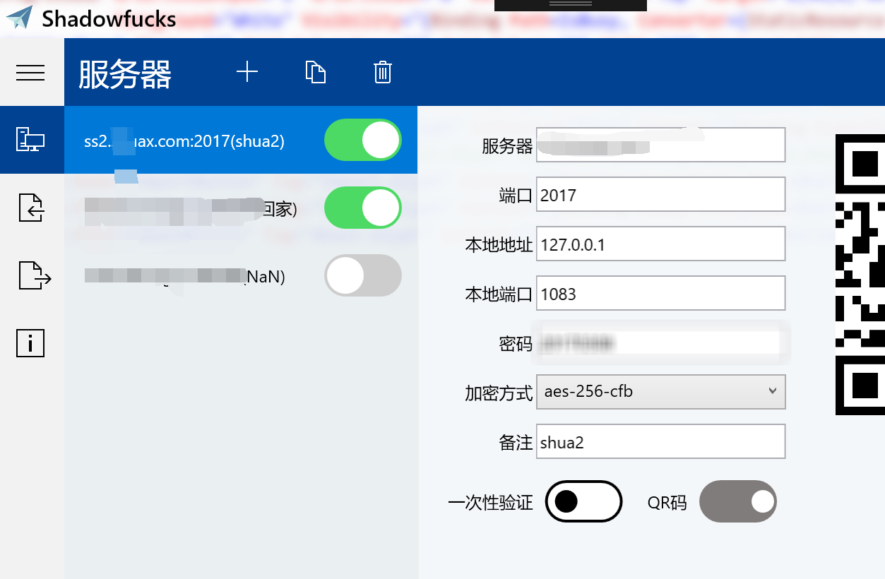

# Preview

#### 警告：本仓库的代码可能会让部分科学家产生不适

# 孔己已巳的故事

孔己已巳是站着访问自由互联网而穿长衫的唯一的人。他身材很高大；青白脸色，皱纹间时常夹些伤痕；一部乱蓬蓬的花白的胡子。穿的虽然是长衫，可是又脏又破，似乎十多年没有补，也没有洗。他对人说话，总是满口“密码学”、“通信学”、“算法”，叫人半懂不懂的。因为他姓孔，别人便从描红纸上的“上大人孔己已巳”这半懂不懂的话里，替他取下一个绰号，叫作孔己已巳。孔己已巳一到群里，所有访问自由互联网的人便都看着他笑，有的叫道，“孔己已巳，你脸上又添上新伤疤了！”他不回答，对管理员说，“来两条CN2线路，必须支持chacha20-ietf算法。”便排出九文大钱。他们又故意的高声嚷道，“你一定又装逼被人打了！”孔己已巳睁大眼睛说，“你怎么这样凭空污人清白……”“什么清白？我前天亲眼见你在群里跟群主争chacha20-ietf的好处，结果被群主吊着打。”孔乙己便涨红了脸，额上的青筋条条绽出，争辩道，“这些都是算法……算法！……路由器上的加密，那能算加密么？”接连便是难懂的话，什么“路由器受不了AES算法，CPU要被烧”，什么“流加密、块加密、明文攻击、流量追查”之类，引得众人都哄笑起来：群内外充满了快活的空气。 

孔己已巳访问了半个小时的自由互联网，涨红的脸色渐渐复了原，旁人便又问道，“孔己已巳，你当真认识通信协议么？”孔己已巳看着问他的人，显出不屑置辩的神气。他们便接着说道，“你怎的连半个绿卡也捞不到呢？”孔己已巳立刻显出颓唐不安模样，脸上笼上了一层灰色，嘴里说些话；这回可是全是“tls混淆”、“多线路负载”、“rfc3962”、“rfc793”、”CN2“、“IIJ/KDDI”之类，一些不懂了。在这时候，众人也都哄笑起来：店内外充满了快活的空气。 

在这些时候，我可以附和着笑，掌柜是决不责备的。而且掌柜见了孔己已巳，也每每这样问他，引人发笑。孔己已巳自己知道不能和他们谈天，便只好向孩子说话。有一回对我说道，“你读过书么?”我略略点一点头。他说，“读过书，……我便考你一考。排序中的快排，怎样写的?”我想，讨饭一样的人，也配考我么?便回过脸去，不再理会。孔己已巳等了许久，很恳切的说道，“不能写罢?……我教给你，记着!这些代码应该记着。将来去暴雪面试引擎开发时候，算法部分要用。”我暗想我TM一个.net程序员没事跑暴雪去面试做什么，而且我们.net开发思想也从不将底层暴露出来;又好笑，又不耐烦，懒懒的答他道，“谁要你教，标准库里不是有qsort函数么?”孔己已巳显出极高兴的样子，将两个指头的长指甲敲着键盘，点头说，“对呀对呀!……快排有十二样写法，你知道么?”我愈不耐烦了，努着嘴走远。孔己已巳刚挽起袖子，想自己实现一个快排，见我毫不热心，便又叹一口气，显出极惋惜的样子。

自此以后，又长久没有看见孔己已巳。到了年关，群主取下粉板说，“孔己已巳还欠60元访问自由互联网的钱呢!”到第二年的端午，又说“孔己已巳还欠60元访问自由互联网的钱呢!”到中秋可是没有说，再到年关也没有看见他。

我到现在终于没有见――大约孔己已巳的确如愿以偿被请去喝茶了。没了他我们要怎么选择线路选择加密算法啊，都没人跑benchmark了，顿时不知所措，这时侯有人说这不是知乎鼎盛时期的项目么，可以问问clowwindy，结果一个电话打过去，他说我们既然造了轮子肯定有准备，结果在clowwindy的指引下找到了用油纸包好的代码，历时八十多年没坏，把代码搬过来换上以后转危为安，大家纷纷叹服这些大佬写代码代码的严谨。

# 声明
#### 这个仓库里的所有代码包括上面的那段文字都是屋里那只白额高脚蛛趁我睡觉的时候搞的，我(TsungKang)本人对此毫不知情。我猜这可能是它吃小强吃得太饱一时兴起而为之。至于它从哪抄的代码我也完全不清楚。